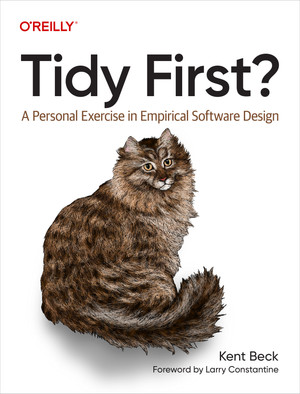
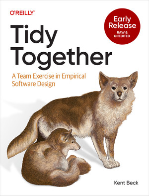
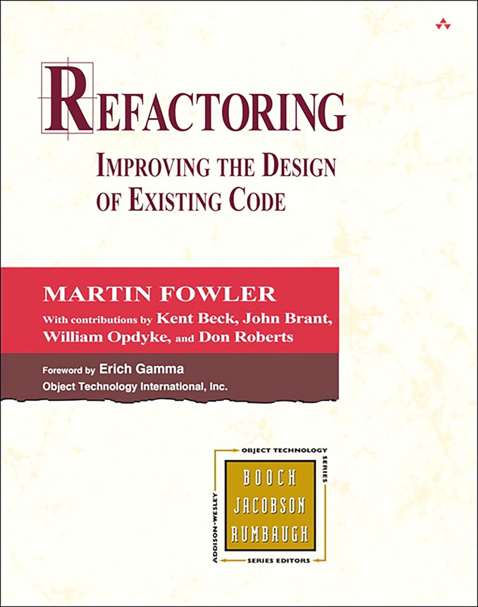
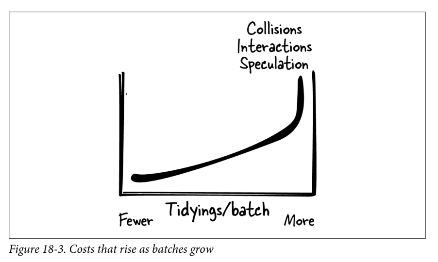
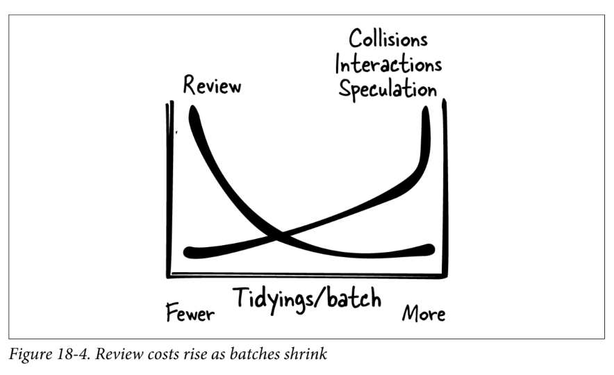
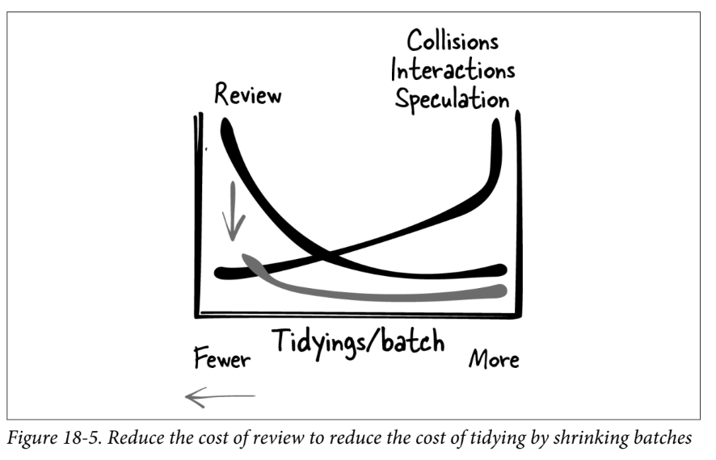
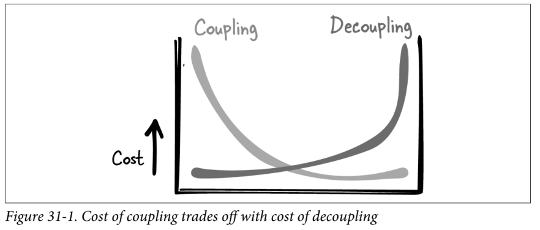

# Tidy First?

**A Personal Exercise in Empirical Software Design**

*Kent Beck* · O'Reilly Media, 2023

---

## About the Author: Kent Beck

- Creator of **Extreme Programming (XP)**
- Pioneer of **Test-Driven Development (TDD)**
- Co-author of the **Agile Manifesto**
- Co-created **JUnit** (with Erich Gamma) and **SUnit**
- Author of *Extreme Programming Explained*, *TDD by Example*, and more

---

## What is This Book About?

> I have some messy code—do I change it or do I tidy it first?

A guide to making small, safe structural improvements to code — and knowing **when** they're worth it. Beck explores the relationship between **structure** and **behavior**, the economics of software design, and why **coupling** and **cohesion** are at the heart of it all.

---

<!-- _class: lead -->

> Software design is an exercise in human relationships.

------

<!-- _class: lead -->

## &ldquo;We start with the programmer's relationship with **themself**.&rdquo;

* *Why don't we take time to care for ourselves?*

* *Take time to make our work easier?*

------



## Up Next: *Tidy Together*

*A Team Exercise in Empirical Software Design*
Kent Beck · O'Reilly Media, September 2026

The sequel extends to the **team** — relationships between programmers.

> We seldom program alone. We are coupled to each other.

---

<!-- _class: lead -->

<style scoped>
section { background: #1a1a2e; color: #eee; display: flex; flex-direction: column; justify-content: space-between; }
ul { padding: 0; margin: 0; }
li { list-style-type: none; text-align: center; }
h1, h2, h3 { text-align: center; }
h1 { color: #e94560; }
h3 { color: #ddd; font-weight: normal; }
.spoiler { font-size: 0.7em; text-align: center; color: #e94560; letter-spacing: 0.2em; }
</style>

<div class="spoiler">⚠️ SPOILER ALERT ⚠️</div>

# Tidy First?

* ### &ldquo;Maybe.&rdquo;
* ### &ldquo;Likely yes. Just enough. You're worth it.&rdquo;

<div class="spoiler">⚠️ SPOILER ALERT ⚠️</div>

---

## How is This Book Structured?

Three parts:
1. **Tidyings** — concrete, small structural changes
2. **Managing** — when and how much to tidy
3. **Theory** — *why* tidying works (coupling, cohesion, economics)

---

<!-- _class: lead -->

# Part I: Tidyings

---

## What Are Tidyings?

- A subset of refactorings
- Small, safe **structural** changes that don't change **behavior**
- Think minutes, not hours
- Mechanical and reversible — e.g. rename, extract, move…
- **"Geek self-care"** — tidying makes your own work easier

---

<!--
_class: lead
_paginate: false
-->

## A Catalog of Tidyings

<style scoped>table { font-size: 0.85em; }</style>

| | | |
|---|---|---|
| Guard Clauses | Cohesion Order | Chunk Statements |
| Dead Code | Move Declaration & Init Together | Extract Helper |
| Normalize Symmetries | Explaining Variables | One Pile |
| New Interface, Old Implementation | Explaining Constants | Explaining Comments |
| Reading Order | Explicit Parameters | Delete Redundant Comments |

---



## See Also:

### *Improving the Design of Existing Code*
Martin Fowler (1999, 2nd ed. 2018)

---

## Fowler's Catalog of Refactorings

<style scoped>ul { columns: 3; font-size: 0.55em; list-style: none; margin-top: 0.3em; } h2 { font-size: 0.9em; }</style>

60+ refactorings including:

- Extract Function / Inline Function
- Extract Variable / Inline Variable
- Move Function / Move Field
- Rename Field / Rename Variable
- Encapsulate Variable / Collection / Record
- Replace Nested Conditional with Guard Clauses
- Slide Statements
- Remove Dead Code
- Split Loop / Split Phase
- Introduce Parameter Object
- Replace Primitive with Object
- Replace Magic Literal
- Decompose Conditional
- Replace Conditional with Polymorphism
- Hide Delegate / Remove Middle Man
- Pull Up Method / Push Down Method
- Combine Functions into Class
- Replace Subclass with Delegate
- Separate Query from Modifier
- Replace Loop with Pipeline
- ...and many more

Beck's 15 tidyings are a **deliberately small subset** — the simplest, safest starting points.

---

## On Tidying...

> *Always* and *only* take tiny steps.

> "A little" is a cognitive measure, not a lines-of-code measure.

> Imagining the experience of a reader of your code.

> As a reader, you'd like consistency.

---

## On Tidying... (cont.)

> Tidying is geek self-care.

> Just because you can tidy doesn't mean you should tidy.

> You are not just instructing a computer, you are explaining your intentions for the computer to other people.

> Make no sudden moves. You're working with incomplete and changing information.

---

## On Tidying... (cont.)

> Since change is the dominant cost of software development and understanding code is the dominant cost of change, communicating the structure and intent of working code is one of the most valuable skills you can exercise.

> Software creates value in two ways: what it does today, and the possibility of new things we can make it do tomorrow.

> The structure of the system doesn't matter to its behavior. One big function, a whole bunch of itty bitties, same paycheck comes out. The structure creates options.

---

## On Tidying... (cont.)

> Tidyings are the Pringles of software design. When you're tidying first, resist the urge to eat the next one.

> `cost(software) ~= coupling`

> More than an hour of tidying at a time before making a behavior change likely means you've lost track of the minimum set of structure changes needed.

> Tidy first? Likely yes. Just enough. You're worth it.

---

## Core Themes

- **Coupling** and **Cohesion**
- Structure changes vs. behavior changes
- The economics of software design
- Tidying as "geek self-care"

---

<!-- _class: lead -->

# Part II: Managing

> Tidying is geek self-care.

---

## When to Tidy?

> Just because you *can* tidy doesn't mean you *should* tidy.

Tidying is designing software **a little at a time, all the time**.

> Tidyings are gateway refactorings.

---

## 16. Separate Tidying

> Sequences of tidyings go in one PR. Behavior changes go in a separate PR.

- Each time you switch between tidying and changing behavior, open a new PR
- How you lump or split PRs is a trade-off

---

## The Review Latency Loop

> If code gets reviewed rapidly, you're encouraged to create more, smaller PRs. Those more-focused PRs encourage even more rapid reviews.

> Equally, this reinforcing loop can run backward.

> I encourage you to experiment with **not requiring reviews for tidying PRs**.

---

## 17. Chaining

> Tidyings set up further tidyings.

> Understanding code is the dominant cost of change. Communicating the structure and intent of working code is one of the most valuable skills you can exercise.

---

## 18. Batch Sizes

> Tidying is not looking toward a far-ahead future. Tidying meets an immediate need.

The Goldilocks dilemma — how many tidyings per batch?

---

## Costs That Rise as Batches Grow

- **Collisions** — longer delay before integrating → more merge conflicts
- **Interactions** — a batch accidentally changing behavior
- **Speculation** — tidying "just because" instead of for the next behavior change



---

## Reducing Batch Cost

> If we want to reduce the cost of tidying, we can reduce the cost of review.

Cheaper review → smaller batches → more tidying → cheaper behavior changes



---

## Reduce Review Cost → Reduce Tidying Cost



---

## 19. Rhythm

> Part of the art of managing tidying is managing the rhythm of it.

> More than an hour of tidying before making a behavior change likely means you've lost track of the minimum set of structure changes needed.

---

## Pave the Path

> A college built buildings, then planted all the area between them with grass. A few months later, students' feet had worn paths. The planners paved those areas.

> Behavior changes tend to cluster in the code (Pareto: 80/20). Tidyings cluster in exactly those spots most attractive for behavior changes.

---

## 20. Getting Untangled

When tidying and behavior changes are mixed up, three options:

1. **Ship as-is** — quick but impolite to reviewers
2. **Untangle** into separate PRs/commits — more polite but more work
3. **Start over**, tidying first — most work but cleanest result

> You are not just instructing a computer, you are explaining your intentions to other people.

---

## 21. First, After, Later, Never

The central question of the book:

**When** should you tidy?

---

## Tidy Never

> You're never changing this code again.
> There's nothing to learn by improving the design.

For truly static systems: "If it ain't broke, don't fix it."

---

## Tidy Later

- Big batch of tidying without immediate payoff
- Eventual payoff for completing the tidying
- As a **learning tool** — tidying illuminates the design as it could be
- If waiting substantially increases the cost, consider doing it now

---

## Tidy After

> You changed the behavior. Now you see how it could have been easier.

Tidy after, if:
- You're going to change the same area again. **Soon.**
- It's cheaper to tidy now.
- The cost is roughly proportional to the cost of behavior changes.

---

## Tidy First

> Tidy first? It depends.

- If tidying doesn't make it easier, don't tidy first
- Tidying helps you comprehend faster? Sure, tidy first
- If it will pay off weekly for years, go for it

> In general, bias toward tidying first, but be wary of tidying becoming an end in itself.

---

## When to Tidy — Summary

| When | Condition |
|------|-----------|
| **Never** | Code won't change; nothing to learn |
| **Later** | Big batch; eventual payoff; learning |
| **After** | Cheaper now; will revisit soon |
| **First** | Immediate payoff; you know what & how |

---

<!-- _class: lead -->

# Part III: Theory

> The forever questions in software design

---

## The Forever Questions

> - When do I **start** making software design decisions?
> - When do I **stop** making software design decisions and get on with changing behavior?
> - How do I make the **next** decision?

> Understanding theory lets you disagree constructively with your fellow geeks.

---

## 22. Beneficially Relating Elements

> What is software design? **Beneficially relating elements.**

---

## Elements

> tokens → expressions → statements → functions → objects/modules → systems

- Elements have **boundaries**
- Elements contain **subelements**
- Hierarchy of composition

---

## Relating

> In software design, we have relationships like:
> - Invokes
> - Publishes
> - Listens
> - Refers

---

## Beneficially

> Software designers can only:
> - Create and delete elements
> - Create and delete relationships
> - Increase the benefit of a relationship

---

## Example: Beneficially Relating

```
caller()
    return box.width() * box.height()
```

becomes:

```
caller()
    return box.area()
Box>>area()
    return width() * height()
```

One new element (`Box.area()`), one fewer relationship, simpler caller.

---

## 23. Structure and Behavior

> Software creates value in two ways:
> - What it does **today**
> - The possibility of new things we can make it do **tomorrow**

---

## Behavior Creates Value

**Input/output pairs** — given these inputs, produce these outputs
**Invariants** — these properties always hold true

> Bit rot is real. Staying in place in the river requires constant paddling.

---

## Structure Creates Options

> The structure of the system doesn't matter to its behavior. One big function, a whole bunch of itty bitties, same paycheck comes out.

> The structure creates **options**.

> As soon as I added to the options of what it could do next, I had already made money.

---

## What Interferes with Options?

- A key employee quits
- You distance yourself from your customers
- The cost of changes skyrockets

> Structure changes and behavior changes are both ways to create value, but they are fundamentally different. How? In a word, **reversibility**.

---

## 24–25. Economics: Time Value

> A dollar today is worth more than a dollar tomorrow, so earn sooner and spend later.

> In a chaotic situation, options are better than things, so create options in the face of uncertainty.

These two strategies **conflict** at times.

---

## 26. Options

> Software design is preparation for change; change of behavior.

> Design we do today is the premium we pay for the "option" of "buying" the behavior change tomorrow.

> The more uncertain my predictions of value are, the greater the value of the option is.

---

## 27. Options vs. Cash Flows

**Discounted cash flow** says: Don't tidy first.
**Options** says: Absolutely tidy first.

The resolution:

`cost(tidying) + cost(change after) < cost(change without tidying)`

→ Tidy first, for sure.

---

## Even When the Math Doesn't Work…

> You might still want to tidy first.
> Amortizing the cost across all future changes might make sense.

> "There's more good stuff here, but I need to tidy to be able to see it."

> A little bit of "tidying as self-care" is justified.

---

## 28. Reversible Structure Changes

> The difference between a bad haircut and a bad tattoo.

- Structure changes are generally **reversible**
- Treat reversible decisions differently than irreversible ones
- Code review processes don't distinguish between them — *what a waste*

---

## Making the Irreversible Reversible

> "Extract as a service" tends to be a big deal and hard to undo.

> Does it require checking a feature flag in many places? Tidy first so it only requires a few.

> We are making "extract as a service" reversible, at least for a while.

---

## 29. Coupling

> Two elements are **coupled** with respect to a particular change if changing one necessitates changing the other.

`coupled(E1, E2, Δ) ≡ ΔE1 ⇒ ΔE2`

> Coupling drives the cost of software.

---

## Coupling Properties

- **1-to-N** — one element can be coupled with many others
- **Cascading** — a change ripples, triggering further changes

> The 1–N problem can be mitigated with tooling (automated refactoring).
> Cascading changes are the bigger issue.

---

## 30. Constantine's Equivalence

> `cost(software) ≈ cost(change) ≈ cost(big changes) ≈ coupling`

Or simply:

> **cost(software) ≈ coupling**

> To reduce the cost of software, we must reduce coupling.

---

## 31. Coupling vs. Decoupling

> Coupling, like the Lego piece in the night, often isn't obvious until you step on it.

- Pay the cost of coupling, or pay the cost of decoupling
- The more you reduce coupling for one class of changes, the greater the coupling for other classes
- Exact costs aren't knowable in advance



---

## 32. Cohesion

> Coupled elements should be subelements of the same containing element. Shovel all the manure into one pile.

> Make no sudden moves. You're working with incomplete and changing information.

> Move one element at a time. Make the code tidier for the next person.

---

<!-- _class: lead -->

# Conclusion

---

## The Checklist

- **Cost** — Will tidying make costs smaller, later, or less likely?
- **Revenue** — Will tidying make revenue larger, sooner, or more likely?
- **Coupling** — Will tidying mean I need to change fewer elements?
- **Cohesion** — Will tidying put the elements I need to change in a smaller scope?

---

## The Human Element

> Will tidying bring peace, satisfaction, and joy to your programming?

> You can't be your best self if you're always rushing, if you're always changing code that's painful to change.

---

## The Pringles Problem

> Tidyings are the Pringles of software design. When you're tidying first, resist the urge to eat the next one.

> Tidy to enable the next behavior change. Save the tidying binge for later.

---

## Final Words

> We seldom program alone. Just as there is coupling between elements in a design, we are coupled to each other. A change I make can ripple to you, and a change you make can ripple to me.

> Tidy first? Likely yes. Just enough. **You're worth it.**

---

# Thanks!
