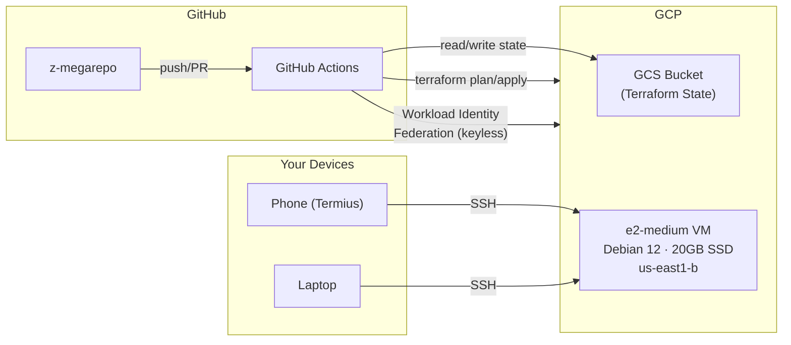
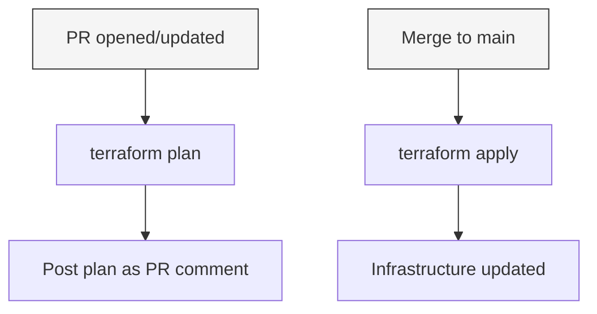

# Infrastructure Plan: GCP Cloud Dev VM

## Goal

A cloud development VM on GCP that can be SSH'd into from anywhere (phone, laptop, etc.) for dev work. Infrastructure is managed via Terraform and deployed through GitHub Actions CI.

## Architecture Overview

## CI Flow

## Components

### 1. `infra/bootstrap/` — One-time manual setup

A shell script (not CI-managed) that creates the resources CI itself depends on:

- GCS bucket for Terraform remote state
- Enable required GCP APIs (Compute, IAM, Cloud Resource Manager)
- Workload Identity Federation pool + provider for GitHub Actions auth
- Service account with scoped permissions for Terraform

### 2. `infra/cloud-dev-vm/` — Terraform root module

| Resource | Details |
|---|---|
| `google_compute_instance` | e2-medium, Debian 12, 20GB pd-ssd, us-east1-b |
| Public IP | Ephemeral, for direct SSH access |
| OS Login | Enabled — SSH identity tied to Google account |
| Firewall rule | Allow TCP:22 from 0.0.0.0/0 |
| Startup script | Installs git, nvm, helix, claude code |

Terraform backend: GCS bucket created by bootstrap.

### 3. `.github/workflows/` — CI

- **`terraform-shared.yml`** — Reusable workflow containing plan/apply logic
- **`terraform-cloud-dev-vm.yml`** — Triggers on changes to `infra/cloud-dev-vm/**`

Auth via Workload Identity Federation (no stored keys).

### 4. `infra/billing/` — Future

Budget alerts and monitoring dashboards. Separate Terraform root module, separate workflow trigger.

## Step-by-Step Implementation

### Phase 1: Bootstrap (manual, one-time)

1. Write `infra/bootstrap/bootstrap.sh`
2. User runs it with their GCP project ID
3. Script creates:
   - GCS bucket `{project-id}-tfstate`
   - Workload Identity pool `github-actions-pool`
   - Workload Identity provider linked to this GitHub repo
   - Service account `terraform-ci@{project}.iam.gserviceaccount.com`
   - IAM bindings: service account → Workload Identity, service account → project roles
   - Enables Compute, IAM, and Cloud Resource Manager APIs

### Phase 2: Terraform for the VM

1. Write `infra/cloud-dev-vm/variables.tf` — project ID, region, zone
2. Write `infra/cloud-dev-vm/main.tf` — provider, backend, VM, firewall
3. Write `infra/cloud-dev-vm/outputs.tf` — external IP, ssh command
4. Write `infra/cloud-dev-vm/startup.sh` — installs git, nvm, helix, claude code
5. Write `infra/cloud-dev-vm/.gitignore` — tfstate, tfvars, .terraform/
6. Write `infra/cloud-dev-vm/terraform.tfvars.example` — template for required vars

### Phase 3: GitHub Actions CI

1. Write `.github/workflows/terraform-shared.yml` — reusable workflow:
   - Inputs: working directory, GCP project, WIF provider
   - On PR: `terraform init` → `plan` → comment on PR
   - On merge to main: `terraform init` → `apply -auto-approve`
2. Write `.github/workflows/terraform-cloud-dev-vm.yml`:
   - Triggers on pushes/PRs that touch `infra/cloud-dev-vm/**`
   - Calls the shared workflow

### Phase 4: First deploy

1. Run bootstrap script manually
2. Push Terraform + workflow code
3. CI runs `terraform apply`
4. SSH into VM from Termius

## Future Work

- **Billing alerts** (`infra/billing/`) — budget thresholds, email notifications
- **Docker** on the VM — deferred for now
- **Auto-shutdown / scheduling** — stop VM during off-hours to save cost
- **Spot/preemptible** — evaluate for further cost savings
