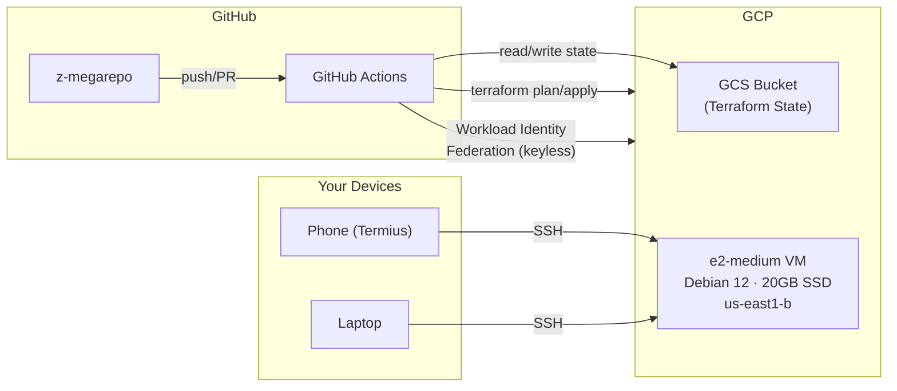
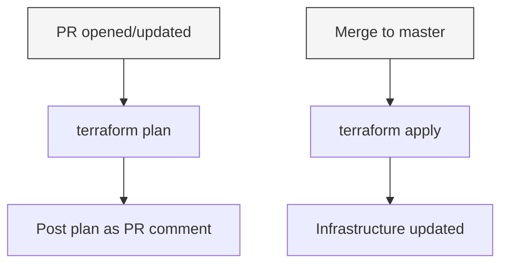

# infra/

Infrastructure-as-code (Terraform) for GCP resources in the `z-megarepo`
project.

## Architecture

## CI flow

Auth via Workload Identity Federation (no stored keys). See
[`bootstrap/`](bootstrap/) for the one-time setup.

## Directory layout

- **[`bootstrap/`](bootstrap/)** — One-time GCP project setup: remote state
  bucket, service account, and Workload Identity Federation for CI.
- **[`cloud-dev-vm/`](cloud-dev-vm/)** — Terraform root module for a remote
  development environment (e2-medium, Debian 12, static IP, OS Login).

## Future work

- **Billing alerts** (`infra/billing/`) — budget thresholds, email notifications
- **Auto-shutdown / scheduling** — stop VM during off-hours to save cost
- **Spot/preemptible** — evaluate for further cost savings
